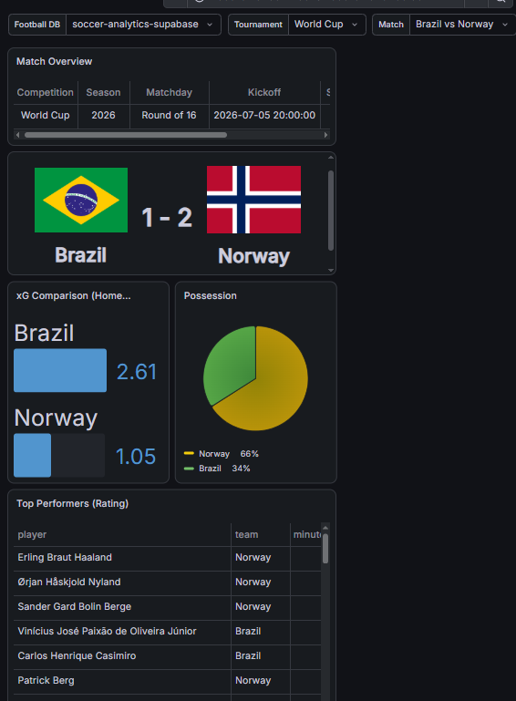

# Soccer Analytics Pipeline

An end-to-end data pipeline that syncs live football match data, statistics, 
and events from the Highlightly API into a Supabase (Postgres) database, 
automated via GitHub Actions, and visualized through interactive Grafana dashboards.

## What it does
- Automatically syncs match results, team stats, player performance, and 
  minute-by-minute match events on a daily schedule (GitHub Actions cron job)
- Stores normalized relational data in Postgres (Supabase), with idempotent 
  upserts so re-runs never create duplicates
- Powers two interactive dashboards: a per-match overview (shots, xG, 
  possession, discipline) and a player performance explorer with cascading 
  season → team → player filters

## Tech stack
Python · PostgreSQL (Supabase) · GitHub Actions · Grafana · SQL

## Skills demonstrated
- REST API integration & rate-limit-aware data ingestion
- Relational schema design (teams, matches, match_events, player_stats)
- CI/CD automation (scheduled sync jobs, secrets management)
- BI dashboard design (Grafana template variables, joins across tables)



---

# Soccer Analytics: Supabase + Grafana

## 1. Set up Supabase
1. Create a project at supabase.com.
2. Open the SQL Editor and run `soccer_schema.sql` (from the earlier step) to create tables/views.
3. Go to **Project Settings → Database** and copy the connection string (use the **Session pooler**, port 5432).

## 2. Get a Highlightly API key
1. Go to **https://highlightly.net/login** and sign up (free, no credit card).
2. Go to your **Dashboard**: https://highlightly.net/dashboard
3. Copy your API key from there.

## 3. Run the ingestion script
```bash
cd soccer_analytics
pip install -r requirements.txt
cp .env.example .env   # fill in your Highlightly key and DB URL
python ingest.py --league 33973 --season 2025
```
- `--league` is the Highlightly league ID. Look these up via the `/leagues` endpoint (e.g. `https://soccer.highlightly.net/leagues?leagueName=Premier%20League`) using your API key, or check their docs at https://highlightly.net/football-api/documentation/.
- Free tier: 100 requests/day. Each finished match uses 4 requests (venue, statistics, box score, events) on top of the initial matches call, so a full season backfill may need to run across several days.
- Re-running is safe: all inserts use `on conflict ... do update` (idempotent upserts).

## 3. Connect Grafana to Supabase
1. In Grafana: **Connections → Data sources → Add data source → PostgreSQL**.
2. Host: your Supabase pooler host (e.g. `aws-0-xx.pooler.supabase.com:5432`)
3. Database: `postgres`, User/Password: from your connection string.
4. SSL Mode: `require`.
5. Save & test.

## 4. Import the dashboards
1. In Grafana: **Dashboards → New → Import**.
2. Upload `grafana_match_overview.json` and/or `grafana_player_performance.json`.
3. When prompted, map `${DS_SUPABASE}` to the PostgreSQL data source you just created.
4. **Match Overview**: use the **Match** dropdown at the top to switch between games.
5. **Player Performance**: use the **Season → Team → Player** cascading dropdowns. Team and Player default to "All", so squad-wide panels (leaderboard, scatter plots, defensive contribution) work without picking a specific player; pick a player to populate the rating trend, minutes-per-matchday, and match log panels.

## Notes / next steps
- `match_events` (goals, cards, subs, assists by minute) is now populated automatically via Highlightly's `/events/{matchId}` endpoint — this powers the "Match Timeline" panel in the Match Overview dashboard.
- ⚠️ Venue lookup adds a 4th API request per finished match (on top of statistics + box-score + events), so each match now costs 4 requests instead of 3. On the free 100/day tier, that's roughly 25 matches per day — plan backfills accordingly.
- Venue, weather, and referee data are only populated for popular/major leagues per Highlightly's coverage — smaller competitions may return no venue info even after this sync runs.
- For a league table / season dashboard, query the `player_season_stats` view and `team_form` view defined in the schema — happy to build that dashboard JSON too.
- Rate limits: Highlightly's free tier is 100 requests/day. Consider a paid tier ($9.49/mo for 7,500 req/day) if you need faster full-season backfills.
- Highlightly also has a RapidAPI listing if you prefer managing it there instead of highlightly.net directly — search "Highlightly" or "Football Highlights API" on RapidAPI (published by highlightly-api). Same data, different billing dashboard.
